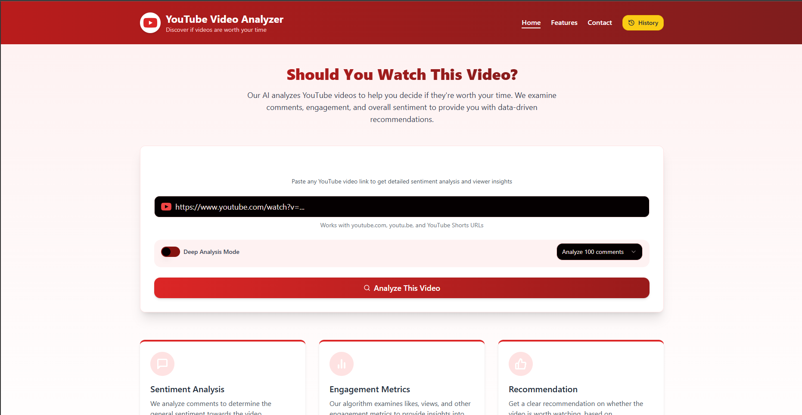
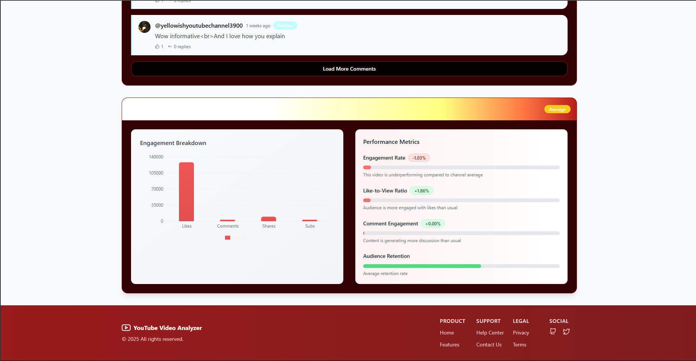
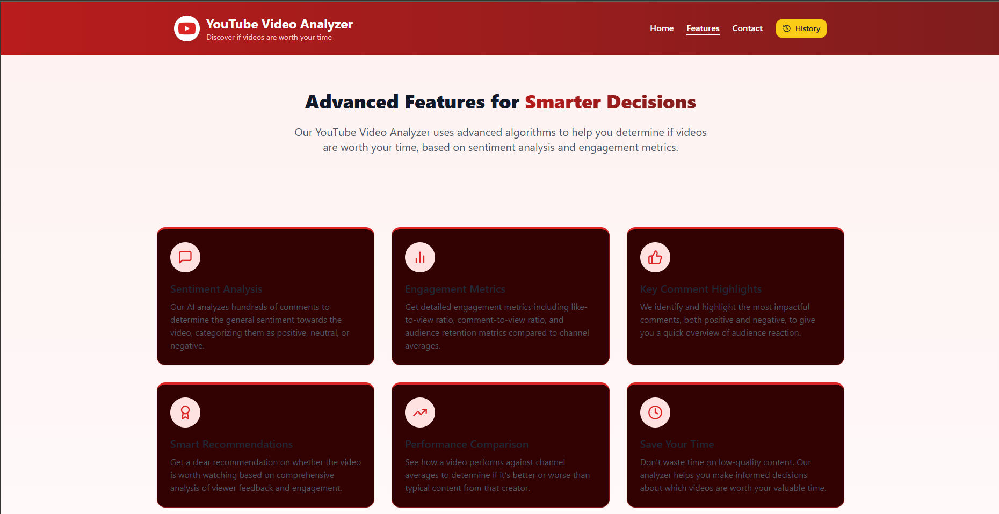
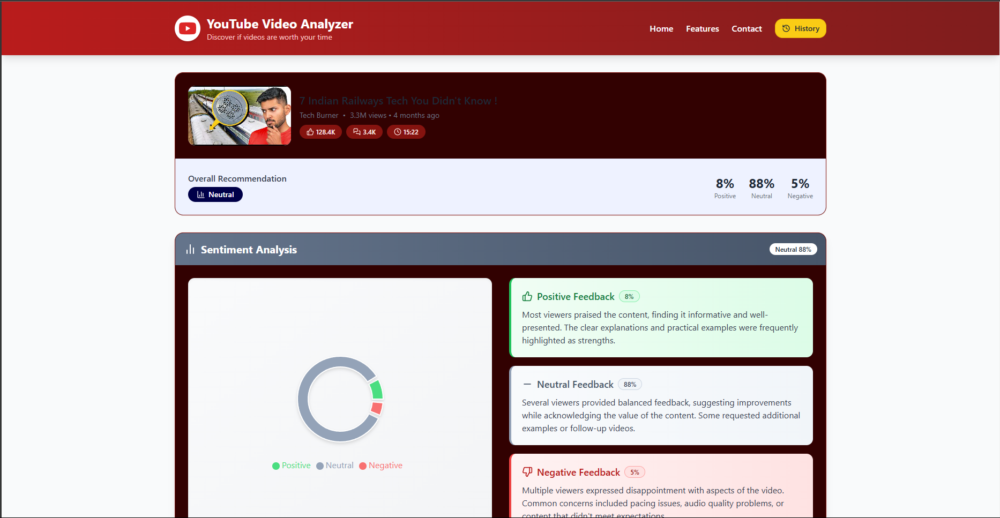
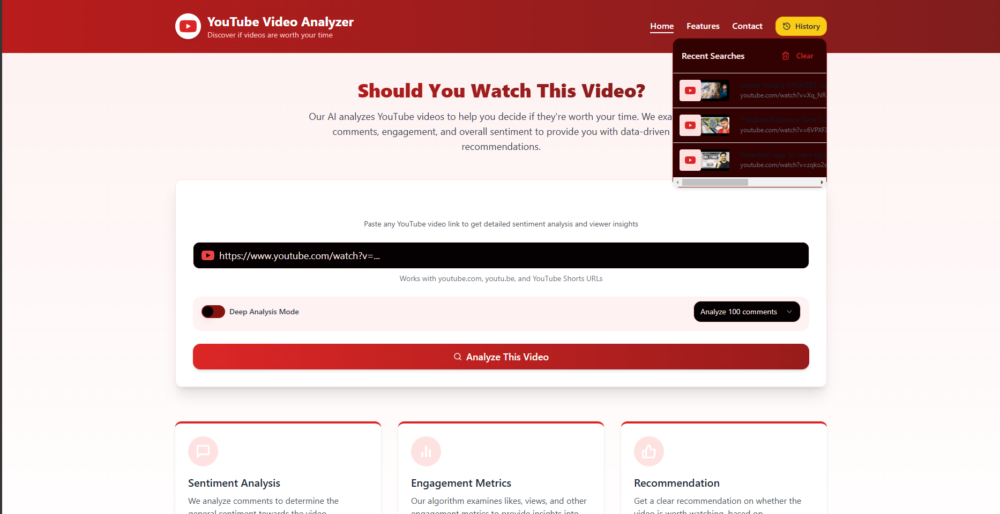
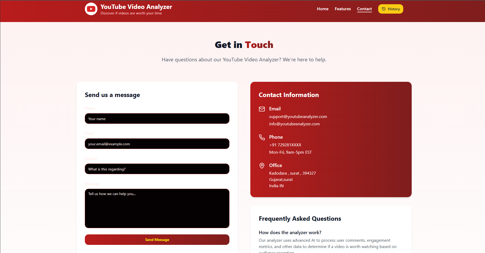

# YouTube Video Analyzer

### Tech Stack:

- Frontend: React.js or Vue.js

- Backend: Node.js with Express or Python (Flask/Django)

- Database (if needed): MongoDB / Firebase

- API Integration: YouTube Data API

- NLP: NLTK, TextBlob, or Hugging Face Transformers

**Discover if videos are worth your time**

## Screenshots

### Home Interface

*Main interface for video analysis*

### Main Analysis Page

*Video URL input and analysis interface*

### Features Overview

*Advanced features for smarter decisions*

### Analysis Results

*Engagement breakdown and performance metrics*

### Sentiment Analysis

*Detailed sentiment analysis with feedback breakdown*

### Contact Page

*Contact form and support information*

